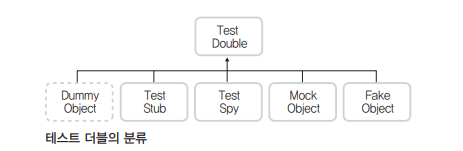
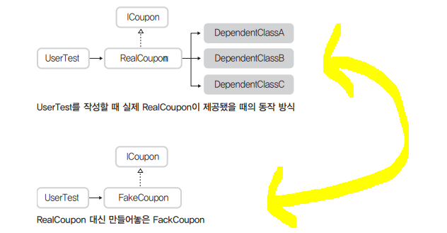
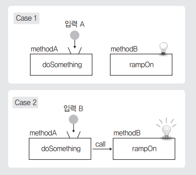
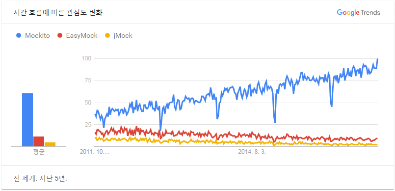

# MOCK를 이용한 TDD

### 1. MOCK란 :grey_question:


:pushpin: **실제 값으로 테스트 하기 어려우니 가짜 값을 사용할 수 있게 해주는 것**


TDD는 테스트 대상(==범위)이 의존하는 것에 대해 **독립적**으로 작성되어야 한다.

:pushpin: **독립적**

​	어떤 테스트도 다른 테스트에 의존하지 않는 다는것. 

:pushpin: MOCK 는 이런 TDD의 독립성을 위한 수단이다.

​	MOCK외에도 `Stub`,`Fake`등이 있다.


### 2. 언제 MOCK를 사용할까 :grey_question:

1. 테스트 작성을 위한 환경구축이 어려울 때

   - 환경을 구축하기 위해 시간이 많이 필요한 경우.
     - 데이터베이스, 웹 서버 등을 설치해야만 테스트 케이스가 가능해 지는 경우
   - 특정 메소드를 아직 개발하지 못했을때, 버그가 있을 때

2. 테스트가 특정 경우나 순간에 의존적일 때

   - 예를 들어 api를 호출할 때 해당 api가 뻗어버리면 테스트 결과를 예측할 수 없다.

     이런 경우 해당 api를 사용하는 부분에서의 응닶값에 MOCK를 적용한다.:+1:

3. 외부 API가 비용이 발생하는 경우

   - SMS
   - Email
   - ...

4. 테스트 시간이 오래 걸리는 경우

   - PC의 성능 문제나 API 호출이 시간 등의 문제로 시간이 걸리는 경우

   - 오래걸리는 구간이나 모듈을 MOCK로 대체한다.


### 3. 테스트 더블

`Stunt Double [ 대역, 스턴트맨 ]`에서 따온 단어로 실제 객체를 사용해서 테스트를 진행하기 어려울 경우 이를 대신해서 테스트를 진행할 수 있도록 만들어 주는 객체를 지칭.



위와 같이 `MOCK`는 테스트 더블 중 하나이다.

1. Dummy Object : 생성된 객체가 필요할 뿐 해당 객체의 기능까지는 필요하지 않는 경우.   **메소드 호출 안함**을 전제로 수행. 단지 테스트가 가능한 환경을 만드는 것이 목적이다.

    void 메소드의 경우 아무일도 발생하지 않으며, 반환값이 있는 메소드의 경우 기본값(0, null, false 등)을 리턴하는 선에서 마무리 한다.

   ```java
   ...
   public class DummyCoupon implements ICoupon {
       @Override
       public int getDiscountPercent(){
           return 0;
       }
       
       @Override
       public String getName(){
           return null;
       }
       ...
   }
   ```

   

2. Test Stub : 기본 타입이 아닌 특정 상황을 가정해야 하는 경우가 생길 경우. 즉 특정 객체의 메소드의 호출이 테스트 케이스 작성과정에 필요한 경우.  

   **특정 값을 리턴**하거나 **특정 메시지를 출력**과 같은작업을 한다. :arrow_forward:의미있는 값을 출력하거나 리턴하는 Dummy Object

   ```java
   ...
   public class StubCoupon implements ICoupon {
       @Override
       public int getDiscountPercent(){
           return 100;
       }
       
       @Override
       public String getName(){
           return 'VIP 고객 한가위 감사쿠폰';
       }
       ...
   }
   ```

    :pushpin: ​거의 **하드 코딩**된 형태이기 때문에 **로직**이 들어가는 부분은 테스트 할 수 없다.

   

3. Fake Object :  실제 필요로 하는 복잡한 로직을 단순화하여 구현한 객체.
	   

   ```java
   ...
   public class FakeCoupon implements ICoupon {
       List<String> categoryList = new ArrayList(); //내부용으로 사용할 목록
       
       public FakeCoupon () {
           category.add("장난감");
           category.add("냄비");
       }
       
       @Override
       public boolean isAppliable(Item item) {
           if (this.categoryList.contains( item.getCategory() )){
               return true;
           }
           return false;
       }
       ...
   }
   ```


   페이크 객체를 만들 때는 적절한 수준에서 구현을 접고 복잡한 부분은 뒤에서의 Mock와 같은 다른 방법을 선택해야 한다.

4. Test Spy : 특정 객체나 메소드가 예상한 횟수만큼 사용됐는지,  정상적으로 호출됐는지를 확인함. 그 밖에 `Dummy`, `Stub`, `Fake`등의 방법을 활용하여 테스트 한다.

   ```java
   public class SpyCoupon implements ICoupon {
       List<String> categoryList = new ArrayList();
       private int isAppliableCallCount;
       
       @Override
       public boolean isAppliable(Item item){
           isAppliableCallCount ++;    //호출되면 증가
           if (this.categoryList.contains( item.getCategory() )){
               return true;
           }
           return false;
       }
       
       public int getIsAppliableCallCount(){
           return this.isAppliableCallCount; // 몇번 호출됐는가?
       }
   }
   ```

   ```java
   @Test
   public void testGetOrderPrice_discountableItem() throws Exception {
   	...
       ICoupon coupon = new SpyCoupon();
       ...
       getOrderPrice(item, coupon));
       int methodCallCount = ((SpyCoupon)coupon).getIsAppliableCallCount();
       assertEquals("coupon.isAppliable 메소드 호출 횟수", 1, methodCallCount);
   }
   ```

   

   일반적으로 잘 사용하지 않는다. 필요한 경우에도 Mock에서 사용한다.

   

5. MOCK Object : 행위를 검증 ( == 행위 기반 테스트 ) 하기 위해 사용되는 객체.

   

   행위를 검증하는 것은 까다로운 절차이다. 만약 상태 기반 테스트가 가능하다면 행위 기반 테스트는 하지 않는 것이 좋다.

   :triangular_flag_on_post:개발 세계에서는 **MOCK**는 `Mock Object`가 아닌 `테스트 더블`과 같은 의미로 사용되는 경우가 더 많다. 또한 MOCK 프레임워크에서는 위에서 언급한 더미객체, Stub,Spy 테스트를 어렵지 않게 구현해 준다.

   

   

   

   ### 4. Mockito

   TDD를 위한 Java mocking 프레임워크.

   과거 `JMock`, `EasyMock`등의 프레임워크가 인기있었지만 현재는 거의 사용하지 않는다.

   

   

   #### - Mock 객체 생성

   ```java
   @Test
   public void TestEx2() {
       Person p = mock(Person.class);
       assertTrue(p != null);
   }
   
   @Mock
   Person p;

   @Test
   public void TestEx2(){
   	MockitoAnnotations.initMocks(this);
       assertTrue(p != null);
   }
   
   ```
   
   
   ### -  when()  :arrow_forward:stub
   
   ```java
   @Test
   public void example(){
       Person p = mock(Person.class);
       when(p.getName()).thenReturn("JDM");
       when(p.getAge()).thenReturn(20);
       assertTrue("JDM".equals(p.getName()));
       assertTrue(20 == p.getAge());
   }
   ```

   지정 메소드에 대해 반환해 줄 값을 설정.

   

   ```java
   public List<String> getList(String name, int age){ 
       // do something code 
   }
   ```

   ​													:arrow_double_down:

   ```java
   when(mockIns.getList(anyString(), anyInt()))
       .thenReturn(
           new ArrayList<String>(){
               { this.add("JDM"); this.add("BLOG"); }
           }
       );
   ```

   

   ### - verify()

   ```java
   @Test
   public void TestEx3() {
       Person p = mock(Person.class);
       String name = "HSH";
       p.setName(name);
       
       verify(p, times(1)).setName(any(String.class)); //Success
       verify(p, never()).getName(); //Success
       verify(p, never()).setName(eq("HSH")); //Fail
       
       //지정된 시간(millis)안으로 1번이상 메소드를 호출 했는가
       verify(p, timeout(100).atLeast(1)).setName(any(String.class)); // Success
   }
   ```

   해당 구문이 호출 됐는지 체크. 횟수나, 타임아웃 시간 까지 지정해서 체크할 수 있다.

   :pushpin:생성된 mock는 자신의 모든 행동을 기억하는데, `verify()`를 사용해서 원하는 메소드가 특정 조건으로 실행했는지를 검증할 수 있다.

   ### - 클래스 내부에 다른 클래스를 포함하는 경우

   ```java
   public class AuthService{
       private AuthDao dao;
     		...
       public boolean isLogin(String id){
           boolean isLogin = dao.isLogin(id);
           if( isLogin ){
               // DO Somethig
           }
           return isLogin;
       }
   }
   public class AuthDao {
       public boolean isLogin(String id){
           // DO Somethig
       }
   }
   ```

   ​												:arrow_double_down:

   ```java
   @Mock
   AuthDao dao;
   
   @InjectMocks
   AuthService service;
   
   @Test
   public void example(){
       MockitoAnnotations.initMocks(this);
       when(dao.isLogin(eq("HSH"))).thenReturn(true);
       assertTrue(service.isLogin("HSH") == true);
       assertTrue(service.isLogin("ETC") == false);
   }
   ```

   

   ### Mock 객체는 흉내를 내는 객체일 뿐이다. 실제 객체로 작동해 보았을 때 작동하지 않을 수도 있다.

